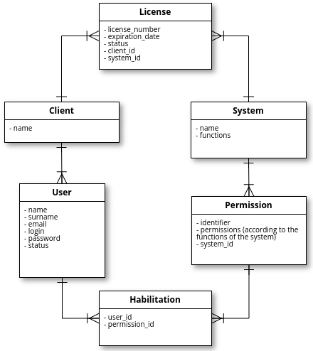

# ManUPCAL-API

API written in Laravel for management of licenses of software systems and applications usage as well as addition of users and permission levels by application

## Summary
The context of this project is the case of a small software company that sells the right and license of utilization for the clients, and have its own portfolios of systems or applications. This company can use this system to manage the licenses, the clients, the applications that each client hired and the users as well as their permission levels according to the clients to which they are associated. The system extracts the functions configured for the system to suggest the fields for the permissions. In the system, the client has only the name property, but it can be easily extended. All the controller functions and routes are documented.

This systems follows the following class diagram:
<div style="text-align: center">
	
</div>

## Technical stack:
* Laravel
* MySQL Database

## Usage Instructions
* Cloning the repository:
	1. ````git clone https://github.com/YasCoMa/manupcal_api.git````
	2. ````cd manupcal_api````

* Configuring database and dependencies: 
	1. ````composer install````
	2. ````mv _.env .env````
	3. Change the variables DB_DATABASE, DB_USERNAME and DB_PASSWORD according to your database settings in the .env file
	4. ````php artisan migrate:refresh --seed````

* Running the api
    1. ````php artisan serve````
    
